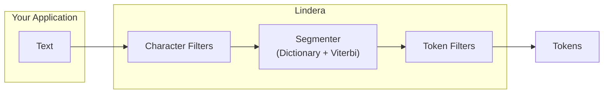

# Lindera

[](https://opensource.org/licenses/MIT)
[](https://crates.io/crates/lindera)

Rust製の形態素解析ライブラリです。Linderaは [kuromoji-rs](https://github.com/fulmicoton/kuromoji-rs) からフォークされ、複数言語のテキストトークナイズに対して、簡単なインストールと簡潔なAPIの提供を目指しています。

## 主な機能

| 機能 | 説明 |
| --- | --- |
| 形態素解析 | Viterbiベースの分割と品詞タグ付け |
| 多言語サポート | 日本語（IPADIC、IPADIC NEologd、UniDic）、韓国語（ko-dic）、中国語（CC-CEDICT、Jieba） |
| 辞書システム | ビルド済み辞書、ユーザー辞書、カスタム辞書学習 |
| テキスト処理パイプライン | 柔軟なテキスト正規化のための組み合わせ可能なキャラクターフィルターとトークンフィルター |
| CRF学習 | 辞書コスト推定のためのカスタムCRFモデルの学習 |
| Pythonバインディング | PyO3を介してPythonからLinderaを利用可能 |
| WebAssembly | wasm-bindgenを介してブラウザでLinderaを実行可能 |
| Pure Rust | C/C++依存なし。Rustがサポートするあらゆるプラットフォームで動作 |

## トークナイズの流れ



## ドキュメントマップ

| セクション | 説明 |
| --- | --- |
| [はじめに](./getting_started.md) | インストール、クイックスタート、サンプル |
| [辞書](./dictionaries.md) | 利用可能な辞書とその使い方 |
| [設定](./configuration.md) | YAMLベースのトークナイザー設定 |
| [応用的な使い方](./advanced_usage.md) | ユーザー辞書、フィルター、CRF学習 |
| [CLI](./cli.md) | コマンドラインインターフェースリファレンス |
| [アーキテクチャ](./architecture.md) | クレート構成と設計の概要 |
| [APIリファレンス](./api_reference.md) | Rust APIドキュメント |
| [コントリビュート](./contributing.md) | Linderaへの貢献方法 |

## クイック例

```rust
use lindera::dictionary::load_dictionary;
use lindera::mode::Mode;
use lindera::segmenter::Segmenter;
use lindera::tokenizer::Tokenizer;
use lindera::LinderaResult;

fn main() -> LinderaResult<()> {
    let dictionary = load_dictionary("embedded://ipadic")?;
    let segmenter = Segmenter::new(Mode::Normal, dictionary, None);
    let tokenizer = Tokenizer::new(segmenter);

    let text = "関西国際空港限定トートバッグ";
    let mut tokens = tokenizer.tokenize(text)?;
    println!("text:\t{}", text);
    for token in tokens.iter_mut() {
        let details = token.details().join(",");
        println!("token:\t{}\t{}", token.surface.as_ref(), details);
    }

    Ok(())
}
```

上記の例は以下のように実行できます：

```shell
cargo run --features=embed-ipadic --example=tokenize
```

実行結果は以下のようになります：

```text
text:   関西国際空港限定トートバッグ
token:  関西国際空港    名詞,固有名詞,組織,*,*,*,関西国際空港,カンサイコクサイクウコウ,カンサイコクサイクーコー
token:  限定    名詞,サ変接続,*,*,*,*,限定,ゲンテイ,ゲンテイ
token:  トートバッグ    名詞,一般,*,*,*,*,*,*,*
```

## ライセンス

Linderaは [MITライセンス](https://opensource.org/licenses/MIT) の下で公開されています。
