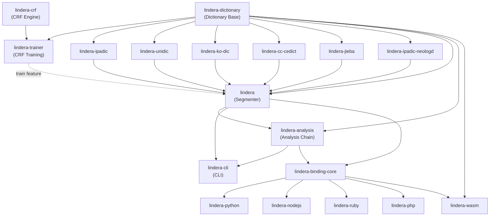

# アーキテクチャ

Linderaは複数のクレートで構成されるCargo workspaceとして構成されています。各クレートは、低レベルのCRF計算から高レベルのCLIや言語バインディングまで、それぞれ明確な責務を持っています。

## クレート依存関係図



## クレート一覧

| クレート | 種類 | 説明 |
| --- | --- | --- |
| `lindera-crf` | コア | Pure RustによるCRF（条件付き確率場）実装。`no_std`サポート。シリアライゼーションに`rkyv`を使用。 |
| `lindera-dictionary` | コア | 辞書ベースライブラリ。辞書の読み込みとビルドを提供。 |
| `lindera-trainer` | コア | CRFベースの辞書学習パイプライン。`lindera-crf`と`lindera-dictionary`の上に構築され、直接、または`lindera`facadeの`train` feature経由で利用される。 |
| `lindera` | コア | 純粋な形態素セグメンター。辞書クレートを統合し、`Segmenter` APIを提供。 |
| `lindera-analysis` | コア | `lindera`の上に構築されたLucene風の分析チェーン。文字フィルタ、トークンフィルタ、およびそれらを`Segmenter`の周りで組み合わせる`Tokenizer`を提供。 |
| `lindera-cli` | アプリケーション | トークナイズ、辞書ビルド、CRF学習のためのコマンドラインインターフェース。 |
| `lindera-binding-core` | コア | 以下の5つの言語バインディングが共有するFFI非依存のヘルパー。 |
| `lindera-ipadic` | 辞書 | IPADICベースの日本語辞書。 |
| `lindera-ipadic-neologd` | 辞書 | IPADIC NEologdベースの日本語辞書（新語対応）。 |
| `lindera-unidic` | 辞書 | UniDicベースの日本語辞書。 |
| `lindera-ko-dic` | 辞書 | ko-dicベースの韓国語辞書。 |
| `lindera-cc-cedict` | 辞書 | CC-CEDICTベースの中国語辞書。 |
| `lindera-jieba` | 辞書 | Jiebaベースの中国語辞書。 |
| `lindera-python` | バインディング | PyO3を利用したPythonバインディング。 |
| `lindera-nodejs` | バインディング | NAPI-RSを利用したNode.jsバインディング。 |
| `lindera-ruby` | バインディング | Magnus + rb-sysを利用したRubyバインディング。 |
| `lindera-php` | バインディング | ext-php-rsを利用したPHPバインディング。 |
| `lindera-wasm` | バインディング | wasm-bindgenを利用したWebAssemblyバインディング。 |

## トークナイズパイプライン

Linderaは複数段階のパイプラインでテキストを処理します：

```text
Input Text
  |
  v
Character Filters    -- Normalize characters (e.g., Unicode normalization, mapping)
  |
  v
Segmenter            -- Segment text into tokens using a dictionary and the Viterbi algorithm
  |
  v
Token Filters        -- Transform tokens (e.g., POS filtering, stop words, stemming)
  |
  v
Output Tokens
```

**Segmenter**がコアコンポーネントです。辞書から候補トークンのラティスを構築し、Viterbiアルゴリズムを適用して最小コストのパスを見つけ、最も適切な分割結果を生成します。

## Featureフラグ

| Feature | 説明 | デフォルト |
| --- | --- | --- |
| `mmap` | 辞書読み込みのためのメモリマップドファイルサポート | 有効 |
| `train` | CRFベースの辞書学習機能（`lindera-crf`に依存） | CLIのみ |
| `embed-ipadic` | IPADIC辞書をバイナリに埋め込み | 無効 |
| `embed-cjk` | IPADIC + ko-dic + Jieba辞書を埋め込み | 無効 |
| `embed-cjk2` | UniDic + ko-dic + Jieba辞書を埋め込み | 無効 |
| `embed-cjk3` | IPADIC NEologd + ko-dic + Jieba辞書を埋め込み | 無効 |

## 詳細

- [はじめに](./getting_started.md) -- インストールと最初のステップ
- [基本概念](./concepts.md) -- 辞書、トークナイズ、フィルター
- [Linderaライブラリ](./lindera.md) -- セグメンター、API
- [Lindera Analysis](./lindera-analysis.md) -- 文字フィルタ、トークンフィルタ、`Tokenizer`
- [Lindera Dictionary](./lindera-dictionary.md) -- 辞書の読み込みとビルド
- [Lindera Trainer](./lindera-trainer.md) -- CRFベースの辞書学習
- [Lindera CRF](./lindera-crf.md) -- CRFエンジン
- [Lindera CLI](./lindera-cli.md) -- コマンドラインインターフェース
- [開発ガイド](./development.md) -- ビルド、テスト、コントリビュート
