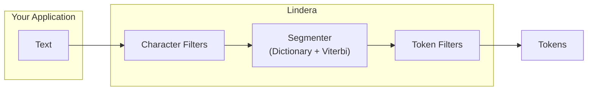

# Lindera

[](https://opensource.org/licenses/MIT)
[](https://crates.io/crates/lindera)

A morphological analysis library in Rust. Lindera is forked from [kuromoji-rs](https://github.com/fulmicoton/kuromoji-rs) and aims to provide easy installation and concise APIs for tokenizing text in multiple languages.

## Key Features

| Feature | Description |
| --- | --- |
| Morphological Analysis | Viterbi-based segmentation and part-of-speech tagging |
| Multi-language Support | Japanese (IPADIC, IPADIC NEologd, UniDic), Korean (ko-dic), Chinese (CC-CEDICT, Jieba) |
| Dictionary System | Pre-built dictionaries, user dictionaries, and custom dictionary training |
| Text Processing Pipeline | Composable character filters and token filters for flexible text normalization |
| CRF Training | Train custom CRF models for dictionary cost estimation |
| Python Bindings | Use Lindera from Python via PyO3 |
| WebAssembly | Run Lindera in the browser via wasm-bindgen |
| Pure Rust | No C/C++ dependencies; works on any platform Rust supports |

## Tokenization Flow



## Document Map

| Section | Description |
| --- | --- |
| [Getting Started](./getting_started.md) | Installation, quick start, and examples |
| [Dictionaries](./dictionaries.md) | Available dictionaries and how to use them |
| [Configuration](./configuration.md) | YAML-based tokenizer configuration |
| [Advanced Usage](./advanced_usage.md) | User dictionaries, filters, and CRF training |
| [CLI](./cli.md) | Command-line interface reference |
| [Architecture](./architecture.md) | Crate structure and design overview |
| [API Reference](./api_reference.md) | Rust API documentation |
| [Contributing](./contributing.md) | How to contribute to Lindera |

## Quick Example

```rust
use lindera::dictionary::load_dictionary;
use lindera::mode::Mode;
use lindera::segmenter::Segmenter;
use lindera::tokenizer::Tokenizer;
use lindera::LinderaResult;

fn main() -> LinderaResult<()> {
    let dictionary = load_dictionary("embedded://ipadic")?;
    let segmenter = Segmenter::new(Mode::Normal, dictionary, None);
    let tokenizer = Tokenizer::new(segmenter);

    let text = "関西国際空港限定トートバッグ";
    let mut tokens = tokenizer.tokenize(text)?;
    println!("text:\t{}", text);
    for token in tokens.iter_mut() {
        let details = token.details().join(",");
        println!("token:\t{}\t{}", token.surface.as_ref(), details);
    }

    Ok(())
}
```

Run the example:

```shell
cargo run --features=embed-ipadic --example=tokenize
```

Output:

```text
text:   関西国際空港限定トートバッグ
token:  関西国際空港    名詞,固有名詞,組織,*,*,*,関西国際空港,カンサイコクサイクウコウ,カンサイコクサイクーコー
token:  限定    名詞,サ変接続,*,*,*,*,限定,ゲンテイ,ゲンテイ
token:  トートバッグ    名詞,一般,*,*,*,*,*,*,*
```

## License

Lindera is released under the [MIT License](https://opensource.org/licenses/MIT).
