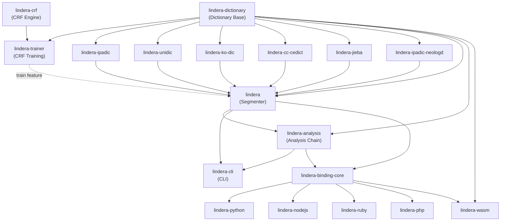

# Architecture

Lindera is organized as a Cargo workspace comprising multiple crates. Each crate has a focused responsibility, from low-level CRF computation to high-level CLI and language bindings.

## Crate Dependency Graph



## Crate Overview

| Crate | Type | Description |
| --- | --- | --- |
| `lindera-crf` | Core | Pure Rust CRF (Conditional Random Field) implementation. Supports `no_std`. Uses `rkyv` for serialization. |
| `lindera-dictionary` | Core | Dictionary base library. Provides dictionary loading and building. |
| `lindera-trainer` | Core | CRF-based dictionary training pipeline. Builds on `lindera-crf` and `lindera-dictionary`; consumed directly or via the `lindera` facade's `train` feature. |
| `lindera` | Core | Pure morphological segmenter. Integrates the dictionary crates and provides the `Segmenter` API. |
| `lindera-analysis` | Core | Lucene-style analysis chain on top of `lindera`: character filters, token filters, and the `Tokenizer` that composes them around a `Segmenter`. |
| `lindera-cli` | Application | Command-line interface for tokenization, dictionary building, and CRF training. |
| `lindera-binding-core` | Core | FFI-independent helpers shared by the five language bindings below. |
| `lindera-ipadic` | Dictionary | Japanese dictionary based on IPADIC. |
| `lindera-ipadic-neologd` | Dictionary | Japanese dictionary based on IPADIC NEologd (includes neologisms). |
| `lindera-unidic` | Dictionary | Japanese dictionary based on UniDic. |
| `lindera-ko-dic` | Dictionary | Korean dictionary based on ko-dic. |
| `lindera-cc-cedict` | Dictionary | Chinese dictionary based on CC-CEDICT. |
| `lindera-jieba` | Dictionary | Chinese dictionary based on Jieba. |
| `lindera-python` | Binding | Python bindings via PyO3. |
| `lindera-nodejs` | Binding | Node.js bindings via NAPI-RS. |
| `lindera-ruby` | Binding | Ruby bindings via Magnus + rb-sys. |
| `lindera-php` | Binding | PHP bindings via ext-php-rs. |
| `lindera-wasm` | Binding | WebAssembly bindings via wasm-bindgen. |

## Tokenization Pipeline

Lindera processes text through a multi-stage pipeline:

```text
Input Text
  |
  v
Character Filters    -- Normalize characters (e.g., Unicode normalization, mapping)
  |
  v
Segmenter            -- Segment text into tokens using a dictionary and the Viterbi algorithm
  |
  v
Token Filters        -- Transform tokens (e.g., POS filtering, stop words, stemming)
  |
  v
Output Tokens
```

The **Segmenter** is the core component. It builds a lattice of candidate tokens from the dictionary, then applies the Viterbi algorithm to find the lowest-cost path, producing the most likely segmentation.

## Feature Flags

| Feature | Description | Default |
| --- | --- | --- |
| `mmap` | Memory-mapped file support for dictionary loading | Enabled |
| `train` | CRF-based dictionary training functionality (depends on `lindera-crf`) | CLI only |
| `embed-ipadic` | Embed the IPADIC dictionary into the binary | Disabled |
| `embed-cjk` | Embed IPADIC + ko-dic + Jieba dictionaries | Disabled |
| `embed-cjk2` | Embed UniDic + ko-dic + Jieba dictionaries | Disabled |
| `embed-cjk3` | Embed IPADIC NEologd + ko-dic + Jieba dictionaries | Disabled |

## Learn More

- [Getting Started](./getting_started.md) -- Installation and first steps
- [Core Concepts](./concepts.md) -- Dictionaries, tokenization, and filters
- [Lindera Library](./lindera.md) -- Segmenter and API
- [Lindera Analysis](./lindera-analysis.md) -- Character filters, token filters, and the `Tokenizer`
- [Lindera Dictionary](./lindera-dictionary.md) -- Dictionary loading and building
- [Lindera Trainer](./lindera-trainer.md) -- CRF-based dictionary training
- [Lindera CRF](./lindera-crf.md) -- The CRF engine
- [Lindera CLI](./lindera-cli.md) -- Command-line interface
- [Development Guide](./development.md) -- Build, test, and contribute
